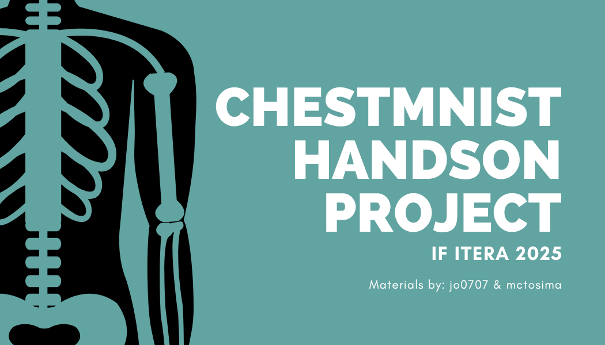

# ChestMNIST Classification (Starter Kit)

Proyek ini adalah starter kit untuk praktikum/latihan klasifikasi gambar medis sederhana menggunakan dataset ChestMNIST. Fokusnya adalah memudahkan mahasiswa untuk mencoba melatih model, melihat grafik hasil latihan, dan melihat prediksi pada beberapa gambar validasi.

## Apa yang kita lakukan di sini?
- Memuat dataset ChestMNIST yang sudah disaring untuk 2 kelas:
  - Cardiomegaly
  - Pneumothorax
- Melatih model CNN sederhana (SimpleCNN) untuk membedakan kedua kelas tersebut.
- Menyimpan grafik proses training (loss dan akurasi) ke file `training_history.png`.
- Menampilkan 10 gambar acak dari data validasi dan mem-plot hasil prediksi + nilai probabilitas + label aslinya ke `val_predictions.png`.

## Struktur Folder/Files
- `train.py` — Script utama untuk melatih model.
- `datareader.py` — Mengambil dan menyiapkan data ChestMNIST untuk klasifikasi biner (2 kelas). Mengatur transformasi gambar.
- `model.py` — Arsitektur model CNN yang sederhana.
- `utils.py` — Fungsi bantu untuk membuat grafik training dan visualisasi prediksi.
- `requirements.txt` — Daftar paket Python yang dibutuhkan.

## Persiapan Lingkungan (Sekali Saja)
Pilih salah satu opsi di bawah ini.

Opsi A — venv (ringan dan standar):
- macOS/Linux (bash):
  ```bash
  python3 -m venv .venv
  source .venv/bin/activate
  pip install -r requirements.txt
  ```
- Windows (PowerShell):
  ```powershell
  python -m venv .venv
  .venv\Scripts\Activate
  pip install -r requirements.txt
  ```

Opsi B — Miniconda/Conda (mudah ganti versi Python):
```bash
conda create -n chestmnist python=3.10 -y
conda activate chestmnist
pip install -r requirements.txt
```

Opsi C — uv (cepat dan modern):
```bash
# Instal uv (macOS/Linux)
curl -LsSf https://astral.sh/uv/install.sh | sh

# Buat dan aktifkan environment
uv venv
source .venv/bin/activate  # macOS/Linux
# Windows PowerShell: .venv\Scripts\Activate

# Instal dependencies (sangat cepat)
uv pip install -r requirements.txt
```

Catatan: Mengunduh dataset ChestMNIST akan dilakukan otomatis saat pertama kali dijalankan (internet diperlukan).

## Cara Menjalankan Training
Jalankan perintah berikut di terminal (pastikan berada di folder proyek ini):

```bash
python train.py
```

Yang akan terjadi:
- Model akan dilatih beberapa epoch (lihat parameter di awal file `train.py`).
- Setelah selesai, file berikut akan dibuat:
  - `training_history.png` — grafik loss dan akurasi (training vs validasi).
  - `val_predictions.png` — 10 gambar validasi acak beserta hasil prediksi (3 baris teks: Pred, Prob, GT).

<!-- Bagian penjelasan parameter dihapus sesuai permintaan -->

## Bagaimana Data Disiapkan?
- File `datareader.py` memfilter dataset ChestMNIST agar hanya menyertakan 2 kelas: Cardiomegaly (label 0) dan Pneumothorax (label 1), dan hanya sampel yang punya satu label (single-label) agar latihan lebih sederhana.
- Gambar dinormalisasi (nilai piksel diskalakan) agar training lebih stabil.

## Tentang Model
- `model.py` berisi `SimpleCNN` (Convolutional Neural Network) sederhana.
- Tujuan model: menerima gambar 28x28 (grayscale) dan memprediksi apakah termasuk Cardiomegaly atau Pneumothorax.
- Loss yang digunakan: `BCEWithLogitsLoss` (cocok untuk 2 kelas biner).

## Hasil dan Visualisasi
- `training_history.png`: membantu melihat apakah model belajar dengan baik (loss turun, akurasi naik).
- `val_predictions.png`: menampilkan 10 gambar contoh dari validasi dengan 3 baris teks berwarna:
  - Biru: Pred (kelas yang diprediksi)
  - Oranye: Prob (angka probabilitas keyakinan model)
  - Hijau: GT (ground truth/label asli)

## Tugas/PR untuk Mahasiswa
Tujuan: tingkatkan performa model pada validasi.

Petunjuk:
1. Coba fine-tuning hyperparameter di `train.py` (dan/atau `model.py`):
  - Ubah `EPOCHS`, `BATCH_SIZE`, `LEARNING_RATE`.
  - Coba optimizer lain: Adam, SGD, RMSprop; atur parameternya (momentum, betas, weight decay).
  - Tambahkan learning rate scheduler: StepLR, CosineAnnealingLR, ReduceLROnPlateau, OneCycleLR.
  - Coba gradient clipping untuk stabilitas (misal clip norm).
  - Atur `pos_weight` pada `BCEWithLogitsLoss` jika data tidak seimbang (imbalance).
2. Coba augmentasi data (di `datareader.py`):
   - Tambahkan transformasi seperti `RandomRotation`, `RandomHorizontalFlip`, dsb, agar model lebih robust.
3. (Lebih Lanjut) Ganti arsitektur model di `model.py`:
   - Perbesar model CNN (lebih banyak channel/layar), atau 
   - Ganti dengan arsitektur lain yang sederhana namun lebih kuat.
4. Jangan mengubah kelas ChestMNIST yang digunakan (tetap 2 kelas: Cardiomegaly dan Pneumothorax). Fokus memperbaiki model/proses training.
5. Dokumentasikan perubahan yang Anda lakukan (apa yang diubah dan kenapa), dan sertakan perbandingan hasil (misalnya akurasi validasi sebelum vs sesudah).

Alur Pengerjaan:
- Fork repository dari akun ini: `jo0707/chest-mnist-classification` (https://github.com/jo0707/chest-mnist-classification)
- Lakukan perubahan pada fork Anda.
- Jalankan training dan simpan hasil (`training_history.png`, `val_predictions.png`).
- Tulis catatan singkat hasil eksperimen dalam format markdown (laporan.md).
- Kirim link repository fork beserta ringkasan perubahan dan hasil.

### Pengumpulan
- Fork WAJIB bersifat publik sehingga repo anda dapat diakses untuk penilaian.
- Kumpulkan link fork Anda melalui [tautan berikut ini](https://tally.so/r/mOWMdk).
- Pastikan repo sudah memiliki:
  - Kode sumber yang sudah dimodifikasi.
  - File `training_history.png` dan `val_predictions.png` dari eksperimen terbaik Anda.
  - File `laporan.md` yang menjelaskan perubahan dan hasil eksperimen.

### Aturan Individu/Kelompok
- Boleh individu (nilai berpotensi lebih tinggi) atau berkelompok maksimal 3 orang.
- Kontribusi tiap orang harus terlihat dari riwayat commit (gunakan git commit/PR). Jangan gunakan fitur upload file langsung sebagai cara utama.
- Setiap anggota sebaiknya berkontribusi langsung pada fork (jejak kontribusi penting untuk penilaian).

### Deadline
- 8 November 2025, pukul 23.59 WIB.

### Pertanyaan & Komentar
- Silakan buka `issue` di repositori utama untuk bertanya atau memberi masukan.

Semangat bereksperimen dan belajar! Jika ada kendala instalasi atau error saat menjalankan `train.py`, silakan cek kembali environment Python dan paket di `requirements.txt`, atau hubungi pengajar/asisten.
